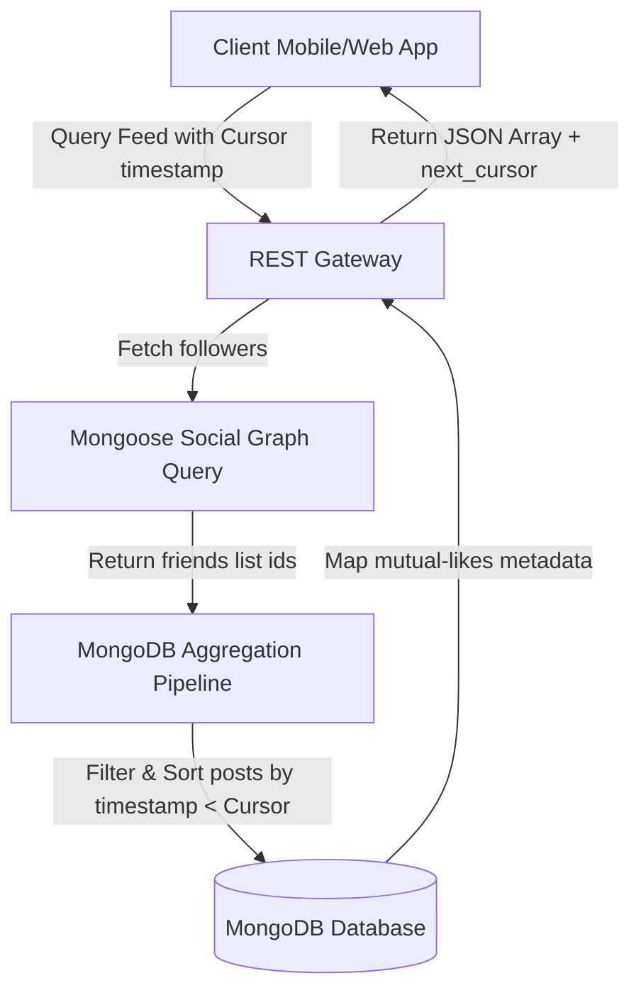

# Social Media API: Cursor-Based Feed Generation & Social Graph Engine

<div align="center">
  
</div>

<div align="center">
     
</div>

خادم **منصة التواصل الاجتماعي** هو محرك برمجي مصمم لبناء وإدارة المنشورات، التعليقات، الإعجابات، والعلاقات المعقدة بين المستخدمين (Social Graph) مع توليد جدول زمني (Feed) فوري وتصفح سريع لا متناهي.

This repository holds the Express backend REST API, database schemas, and feed generation logic for the **Social Media System**. Special focus is placed on query optimizations to support sub-10ms response times.

---

## 🧬 Timeline Generation & Graph Flow

The query engine aggregates timeline feeds dynamically while avoiding duplicate content:



---

## 🧬 Core Services & Layouts

1.  **Feed Generator (`src/controllers/feed.js`)**: Employs cursor-based pagination utilizing timestamp indexes to guarantee fluid scrolling.
2.  **Social Graph Model (`src/models/friendship.js`)**: Tracks user connections, mutual follows, and blocks.
3.  **Real-Time Message Handler (`src/sockets/`)**: Manages chat rooms and online statuses for active friends.

---

## 🛠️ Technology Stack & Assets

*   **Runtime Backend**: Node.js & Express.js server router.
*   **Database Engine**: MongoDB for fast document structures and aggregation pipelines.
*   **Pagination Engine**: Cursor-based pagination logic (offset-free scrolling).

---

## 📂 Repository Module Layout

```text
social-media-api/
├── src/
│   ├── controllers/     # Business logic (Feed, Auth, Comments)
│   ├── models/          # MongoDB schemas (User, Post, Friendship)
│   ├── routes/          # API route bindings
│   └── app.js           # Express initializer
├── package.json         # Node metadata
└── README.md            # System documentation
```

---

## ⚡ Local Setup & Run
```bash
git clone https://github.com/Sayed-Herzallah/social-media-api.git
cd social-media-api
npm install
# Set MONGO_URI in environment variables
npm start
```

---

## 📄 License
Licensed under the **MIT License**.
