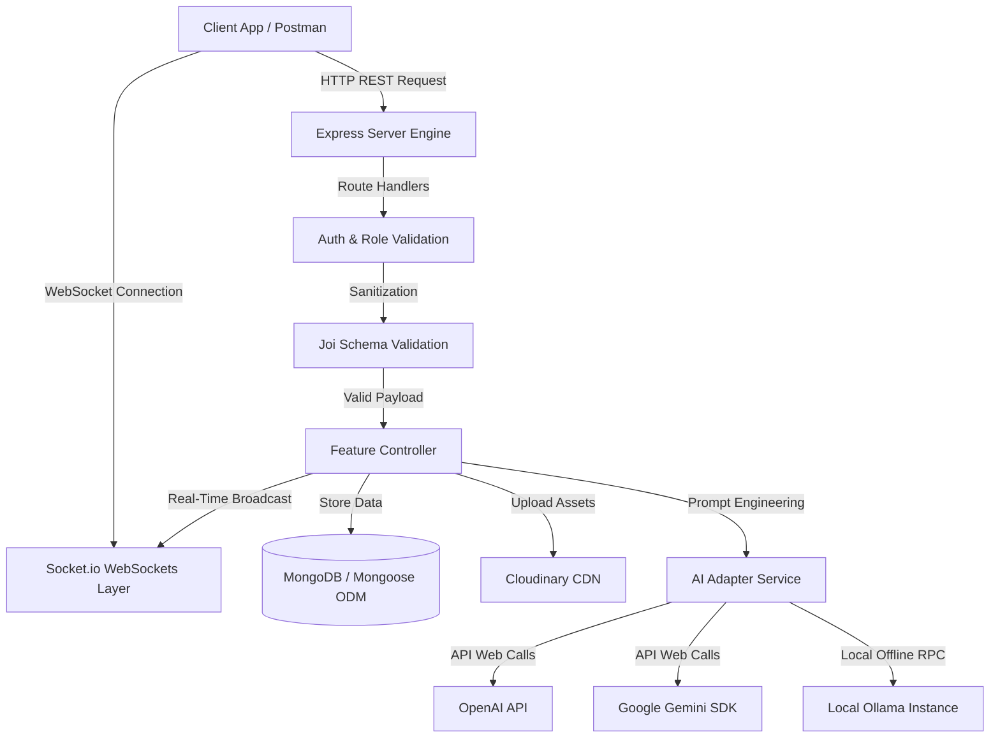

# 🌐 Social Media AI Engine - Real-Time Backend

<div align="center">
  
</div>

A production-grade, AI-integrated, and real-time Social Media API backend built on a modular MVC architecture. This backend powers standard social activities (posts, nested comments, users relationship, administrative controls) and supercharges them with a **Hybrid AI Layer** (supporting Google Gemini, OpenAI, and local Ollama execution) alongside real-time communication via WebSockets.

---

## 🚀 Key Features

* **🔌 Real-Time Communications**: Full-duplex WebSockets using `Socket.io` powering instant notifications, real-time comment streams, post updates, and chat messages.
* **🧠 Hybrid AI Orchestration**: Multi-LLM adapter supporting Google Gemini (`@google/generative-ai`), OpenAI GPT models, and local offline execution via `Ollama`. Powers auto-post generation, text completions, sentiment analysis, and automated content moderation.
* **🖼️ Rich Media Processing**: Multi-part upload pipelines using `Multer` combined with direct streaming and storage optimization on `Cloudinary`.
* **🔒 Enterprise-Grade Security**: Cryptographic salting and password hashing using `Bcrypt`, JWT-based state-less authentication, and database-level field encryption via `Crypto-JS`.
* **🛡️ Bulletproof Data Sanitization**: Strict schema-level validation at the routing layer using `Joi` preventing SQL/NoSQL injections and malformed payloads.
* **📂 Modular MVC Architecture**: Clean code structure separation containing dedicated modules for `Admin`, `Ai`, `Auth`, `Comments`, `Posts`, and `Users`.

---

## 🧬 Architecture & Logic Flow

Below is the visual overview of how request routing, middleware validation, WebSocket events, and AI service calls are processed inside this engine:



---

## 🛠️ Technology Stack & Badges

### Core Architecture
[](https://nodejs.org/)
[](https://expressjs.com/)
[](https://www.mongodb.com/)
[](https://mongoosejs.com/)
[](https://socket.io/)

### Artificial Intelligence & Security
[](https://ai.google.dev/)
[](https://openai.com/)
[](https://ollama.com/)
[](https://cryptojs.gitbook.io/)
[](https://cloudinary.com/)

---

## 📂 Folder Structure

```text
Social-Mdeia Application/
├── index.js               # Application Entrypoint & HTTP Bootstrap
├── app.controller.js      # App setup (CORS, Express Middlewares, Globals, Database Connect)
├── vercel.json            # Serverless deployment configuration
├── Src/
│   ├── DataBase/          # Connection wrapper, Model schemas & indexes
│   │   ├── connection.js
│   │   └── Models/
│   ├── MiddleWare/        # Global request filters
│   │   ├── auth.middleware.js
│   │   └── validation.middleware.js
│   ├── Utils/             # Shared helpers, email templates & cryptographic wrappers
│   │   ├── sendEmail.js
│   │   └── crypto.js
│   └── Modules/           # Modular Domain Features (Routes, Controllers, Schema Rules)
│       ├── Admin/         # Analytics, user bans, audit logs
│       ├── Ai/            # LLM connectors (Gemini, OpenAI, Ollama controllers)
│       ├── Auth/          # Registration, verified logins, JWT signing
│       ├── Comments/      # Nested discussion controllers
│       ├── Posts/         # Rich feed management & cloud uploads
│       └── Users/         # Social graphs (Follows, bios, search indexes)
```

---

## 🚀 Getting Started

### Prerequisites
- Node.js (v20.x or above)
- MongoDB running locally or a MongoDB Atlas URI
- API Keys for Cloudinary, OpenAI, and Google Gemini (Optional if using local Ollama)

### Installation
1. Clone the codebase:
   ```bash
   git clone https://github.com/Sayed-Herzallah/Social-Mdeia-Application.git
   cd Social-Mdeia-Application
   ```
2. Install standard dependencies:
   ```bash
   npm install
   ```
3. Set up your environment file. Create a `.env` in the root:
   ```env
   PORT=3000
   MONGO_URI=mongodb://127.0.0.1:27017/social_media
   JWT_SECRET=your_jwt_signature_key
   CRYPTO_SECRET=your_aes_database_secret_key
   
   CLOUDINARY_CLOUD_NAME=your_cloudinary_name
   CLOUDINARY_API_KEY=your_cloudinary_key
   CLOUDINARY_API_SECRET=your_cloudinary_secret
   
   GEMINI_API_KEY=your_gemini_token
   OPENAI_API_KEY=your_openai_token
   OLLAMA_HOST=http://127.0.0.1:11434
   ```
4. Run in development mode:
   ```bash
   npm start
   ```

---

## 📜 Verified Certificates & Achievements
To review verified technical accomplishments, backend training, and professional project portfolios, click below:

[](https://herzallah.me#certifications)

---

## 👨‍💻 Developed By
**Sayed Herzallah**  
*Backend-Focused Full-Stack Developer*  
- [LinkedIn Profile](https://www.linkedin.com/in/sayed-herzallah)  
- [Portfolio Website](https://herzallah.me)  
- [GitHub Profile](https://github.com/Sayed-Herzallah)  
